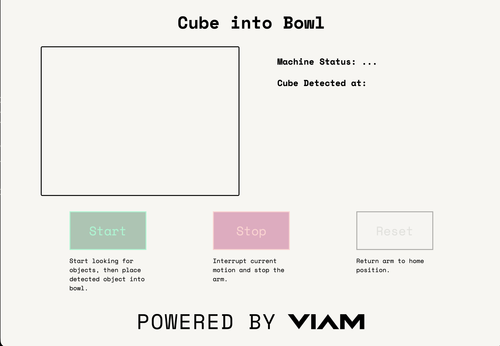

# Cube Sorter Webapp

A TypeScript app that calls the underlying Cube Sorter module to control the Cube Into Bowl demo.

## Main Features
- Vision Service Camera feed (with bounding box detections)
- Machine Connection Status
- Start, Stop, and Reset function buttons